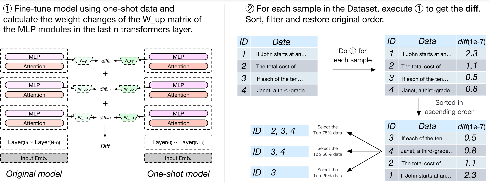

# ResoFilter: Fine-grained Synthetic Data Filtering for Large Language Models through Data-Parameter Resonance Analysis
This repository contains the code for our paper [ResoFilter: Fine-grained Synthetic Data Filtering for Large Language Models through Data-Parameter Resonance Analysis](https://arxiv.org/abs/2412.14809) .

## 🎧 Overview 

ResoFilter is a novel dataset optimization method that enhances the training effectiveness of large language models (LLMs) by integrating models, data, and tasks.

Key features:
- Utilizes the fine-tuning process to obtain Data-Parameter features for data selection
- Improves interpretability by representing data characteristics through model weights
- Achieves comparable results to full-scale fine-tuning using only half the data in mathematical tasks

## ⚡️ Quickstart
#### Step 0. Prepare Environment
    pip install -r requirements.txt

#### Step 1. Download [MetaMathQA](https://huggingface.co/datasets/meta-math/MetaMathQA) dataset
    bash download_math_data.sh

#### Step 2. Run model weight difference
    bash run_gemma.sh

#### Step 3. Run ResoFilter to filter data
    bash run_filter.sh

#### Step 4. Train model
    bash run_train.sh

Feel free to modify the scripts and parameters to fit your own needs!

## 📄 Evaluation

We follow the official implementation of [Open-Instruct](https://github.com/allenai/open-instruct/tree/main/eval) for 
evaluations on GSM8K, BBH, MMLU, etc. Please refer to the official repository for more details.

## 🤔 Citation
If you find this repository useful, please consider giving a star :star: and citation 😘

